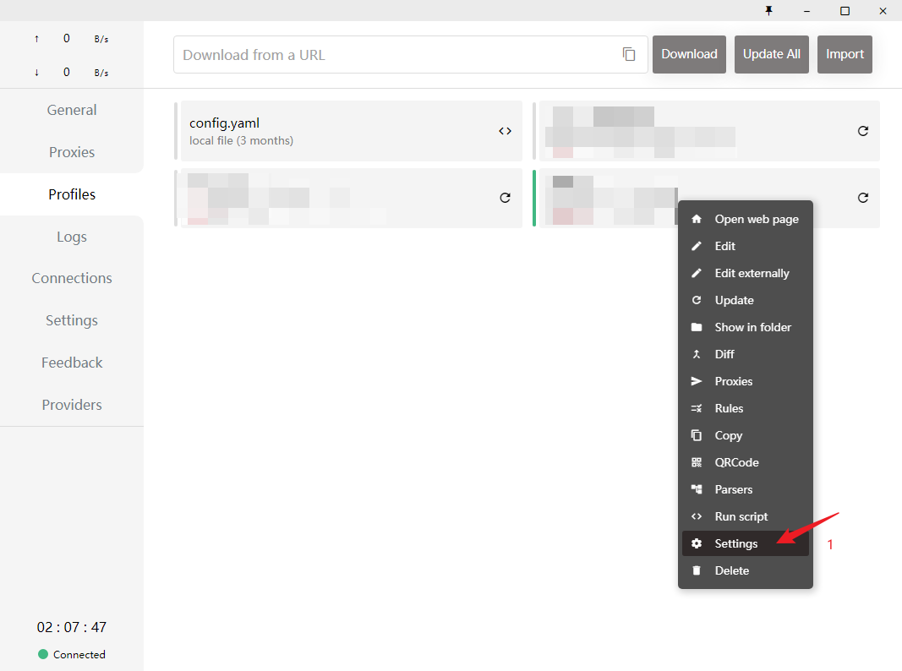
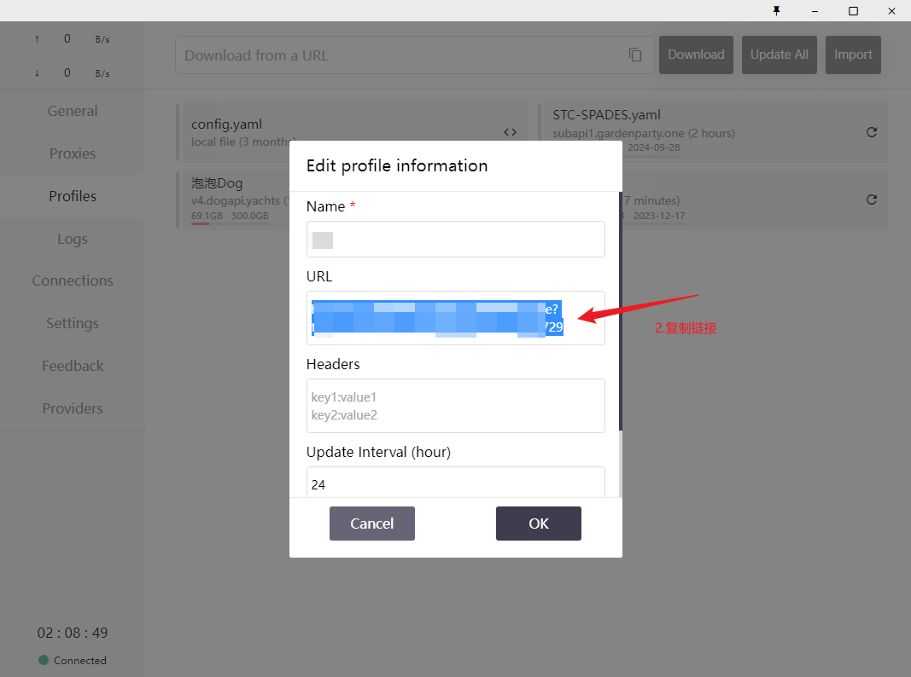
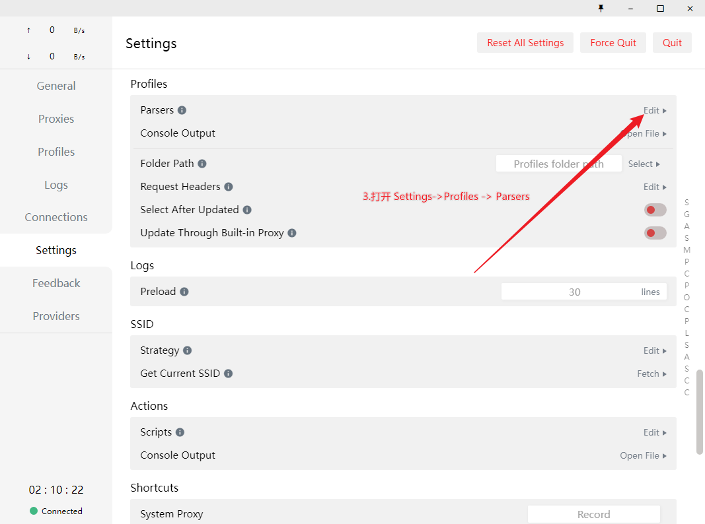
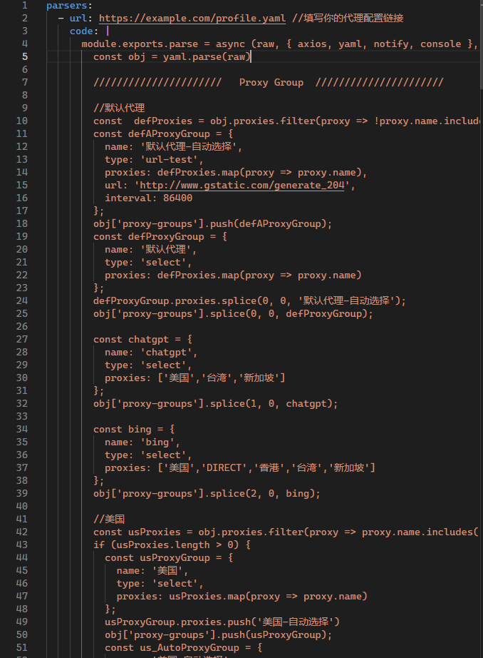

# Clash-for-Windwos 配置文件预处理（JavaScript）

​		日常使用过程中遇到的一些 提供的代理配置文件规则用起来不太方便，CFW的JavaScript提供了一种所有代理配置文件都通用的处理方式，可以添加新的代理组和规则。目前的版本主要是为了方便使用chatgpt和bing。后续我遇到新的不方便的地方会再更新。

​		由于我并不会JavaScript，下面的代码基本都是ai生成的。

## 功能

- 常见国家新建代理组（proxy-groups）
- 为chatgpt和bing分别新建代理组，并设置代理规则
- 添加了[@Loyalsoldier/clash-rulest](https://github.com/Loyalsoldier/clash-rules)的规则集（RULE-SET）


## 使用方式

共有三种使用方式：**parsers.code**、**parsers.file**和**parsers.remote**。

### 方式一 parsers.code

使用[cfw_parsers.yaml](https://github.com/Huffer342-WSH/Clash-for-Windwos-parsers/blob/main/cfw_parsers.yaml)中的代码，步骤如下：

1. 复制代理配置文件的链接
2. 打开parsers
3. 将[cfw_parsers.yaml](https://github.com/Huffer342-WSH/Clash-for-Windwos-parsers/blob/main/cfw_parsers.yaml)中需要的部分复制进去













### 方式二 parsers.file

1. 同方式一，获取配置文件链接然后打开parser

2. 下载[cfw_parser.js](https://github.com/Huffer342-WSH/Clash-for-Windwos-parsers/blob/main/cfw_parser.js)

3. 在parser中填写配置文件链接和cfw_parser.js文件的路径，参考[cfw_parser_use_js.yaml](https://github.com/Huffer342-WSH/Clash-for-Windwos-parsers/blob/main/cfw_parser_use_js.yaml)。注意文件的路径分隔不要使用windows风格的反斜杠“\”

   ```yaml
   parsers:
     - url: https://example.com/profile.yaml
       file: "The-path-to-file/cfw_parser.js"
   
   ```


### 方式三 parsers.remote

1. 同方式一，获取配置文件链接然后打开parser

2. 填写配置文件链接和cfw_parser.js链接

   ```yaml
   parsers:
     - url: https://example.com/profile.yaml
       remote:
         // url: https://github.com/Huffer342-WSH/Clash-for-Windwos-parsers/blob/main/cfw_parser.js
         url: https://cdn.jsdelivr.net/gh/Huffer342-WSH/Clash-for-Windwos-parsers@main/cfw_parser.js
         cache: true # 默认为false，指示是否对重复下载此预处理代码使用缓存
   
   ```


## 致谢

[@Loyalsoldier/clash-rulest](https://github.com/Loyalsoldier/clash-rules)