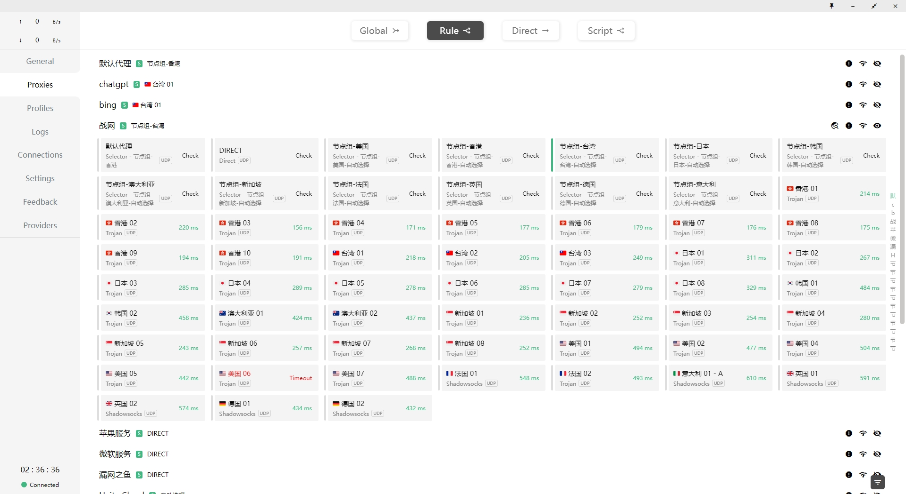

# Clash-for-Windwos 配置文件预处理（JavaScript）

​		Clash可以通过配置文件设置DNS、流量分流等。Clash会根据配置文件中的rules部分，将不同域名或者进程的流量分配到不同的节点或者节点组。参考资料[Clash知识库-Rules 规则](https://clash.wiki/configuration/rules.html)


默认的配置文件往往不尽人意，不过CFW(Clash for Windwos)提过了配置文件预处理(Parsers)功能，可以通过YMAL或者JavaScript对下载后的配置文件进行[预处理](https://docs.gtk.pw/contents/parser.html)。


通过修改CFW提供的JavaScrip方法，当配置文件触发刷新（包括自动更新）时，CFW 会调用此方法对下载的配置文件内容进行处理，再写入本地文件中

```js
module.exports.parse = async (raw, { axios, yaml, notify, console },name, url, interval, selected }) => {
  const obj = yaml.parse(raw)
  return yaml.stringify(obj)
}
```

我想要实现的功能是将一些特殊的网页或者APP单独设置一个节点组，使得我可以单独设置这些应用的代理节点。实现这个功能分为两步:
- 首先是新建一个节点组，节点组里包含若干个节点和节点组可供选择;
- 然后在rules部分将chatgpt相关的域名都设置为这个节点组。

这边我提供给了一个预处理脚本，其功能和使用方法如下：

## 功能

- 修改了DNS规则
- 常见国家新建代理组（proxy-groups）
- 为chatgpt、bing、包厢战网分别新建代理组，并设置代理规则
- 添加了[@Loyalsoldier/clash-rulest](https://github.com/Loyalsoldier/clash-rules)的规则集（RULE-SET）

使用效果如下：

修改节点组中选择的节点，就可以修改对应网页或者应用的代理节点



## 使用方式

共有三种使用方式：**parsers.code**、**parsers.file**和**parsers.remote（推荐）**。

其中**parsers.remote**是拉取远程文件，你可以自己建一个仓库存放，也可以直接使用我的。

> **注意**
>
> 使用远端配置请选择可信的代码提供者，如不能信任代码提供者，可以从远端拷贝代码然后使用code填入而非使用remote方式引入！

### 方式一 parsers.code

使用[cfw_parsers.yaml](https://github.com/Huffer342-WSH/CFW-parsers/blob/main/cfw_parsers.yaml)中的代码，步骤如下：

1. 复制代理配置文件的链接
2. 打开parsers
3. 将[cfw_parsers.yaml](https://github.com/Huffer342-WSH/CFW-parsers/blob/main/cfw_parsers.yaml)中需要的部分复制进去


### 方式二 parsers.file

1. 同方式一，获取配置文件链接然后打开parser

2. 下载[cfw_parser.js](https://github.com/Huffer342-WSH/CFW-parsers/blob/main/cfw_parser.js)

3. 在parser中填写配置文件链接和cfw_parser.js文件的路径，参考[cfw_parser_file.yaml](https://github.com/Huffer342-WSH/CFW-parsers/blob/main/cfw_parser_file.yaml)。注意文件的路径分隔不要使用windows风格的反斜杠“\”。 具体参考[cfw_parser_file.yaml](https://github.com/Huffer342-WSH/CFW-parsers/blob/main/cfw_parser_file.yaml)

   ```yaml
   parsers:
     - url: https://example.com/profile.yaml
       file: "The-path-to-file/cfw_parser.js"
   
   ```

### 方式三 parsers.remote

1. 同方式一，获取配置文件链接然后打开parser

2. 填写配置文件链接和cfw_parser.js链接。参考[cfw_parser_remote.yaml](https://github.com/Huffer342-WSH/CFW-parsers/blob/main/cfw_parser_remote.yaml)

   ```yaml
   parsers:
     - url: https://example.com/profile.yaml
       remote:
         // url: https://raw.githubusercontent.com/Huffer342-WSH/CFW-parsers/main/cfw_parser.js
         url: https://cdn.jsdelivr.net/gh/Huffer342-WSH/Clash-for-Windwos-parsers@main/cfw_parser.js
         cache: true # 默认为false，指示是否对重复下载此预处理代码使用缓存
   
   ```


## 教程/脚本概述

即使你不会JavaScrip也没有问题，因为我也不会。一些简单的功能直接问gpt就行，剩下的就是复制粘贴。

### 1. CFW通过JavaScript预处理文件的实现方法

Clash的配置文件时YAML格式的，YAML是一种类JSON的数据序列化格式，里面就三种结构，键值对、列表、嵌套结构：

1. 键值对：以冒号分隔键和值。
    ```yaml
    name: ChatGPT
    age: 3
    ```

2. 列表：使用短横线（-）表示列表项。
    ```yaml
    fruits:
      - apple
      - banana
      - cherry
    ```
3. 嵌套结构：通过缩进表示嵌套的结构。
    ```yaml
    person:
      name: Alice
      age: 30
      address:
        street: 123 Maple Street
        city: Springfield
    ```

下面是CFW提供的方法模板，可以看到该方法将`raw`从 YAML 格式解析为 JavaScript 对象 `obj`，然后再将其转换回 YAML 字符串并返回。我们只需要修改变量 `obj` 就可以了。

```js
module.exports.parse = async (raw, { axios, yaml, notify, console },name, url, interval, selected }) => {
  const obj = yaml.parse(raw) 
  //添加我们的代码
  return yaml.stringify(obj)
}
```

### 2. 如何通过变量obj访问YAML中对应的元素

```yaml
# DNS 服务设置
# 此部分是可选的. 当不存在时, DNS 服务将被禁用.
dns:
  enable: false
  listen: 0.0.0.0:53
  # ipv6: false # 当为 false 时, AAAA 查询的响应将为空

  # 这些 名称服务器(nameservers) 用于解析下列 DNS 名称服务器主机名.
  # 仅指定 IP 地址
  default-nameserver:
    - 114.114.114.114
    - 8.8.8.8


  # 支持 UDP、TCP、DoT、DoH. 您可以指定要连接的端口.
  # 所有 DNS 查询都直接发送到名称服务器, 无需代理
  # Clash 使用第一个收到的响应作为 DNS 查询的结果.
  nameserver:
    - 114.114.114.114 # 默认值
    - 8.8.8.8 # 默认值
    - tls://dns.rubyfish.cn:853 # DNS over TLS
    - https://1.1.1.1/dns-query # DNS over HTTPS
    - dhcp://en0 # 来自 dhcp 的 dns
    # - '8.8.8.8#en0'

```

上文是YAML文件的一部分，比如说我想要修改默认的DNS服务器，可以看到`nameserver`是一个数组，是属于`dns`的一个属性。因此我们在JavaScript中访问这个数组可以使用点也可以使用方括号，就像python中访问字典中的的键值对一样


```js
obj["dns"]["default-nameserver"] 
或
obj.dns["default-nameserver"] 
```

### 3. 获取节点名称

属性`proxies`是一个数组，其中每一个元素对应一个节点，我们需要得到元素的`name`属性，用于新建节点组和规则。

```js
const proxiesRAW = obj.proxies.map(proxy => proxy.name);
```

这一行代码的作用是从 `obj.proxies` 数组中提取出每个代理对象的 `name` 属性，并将这些名称存储到新的数组 `proxiesRAW` 中


### 4. 筛选节点

```js
const proxiesUseful = proxiesRAW.filter(proxy => {
        return !proxy.includes('剩余') && !proxy.includes('套餐') && !proxy.includes('网址') && !proxy.includes('客服');
    }); 
const proxiesChatgpt = proxiesUseful.filter(proxy => !proxy.includes('香港')); //GPT节点组排除香港

```

`filter` 方法会对数组中的每个元素（在这里是 proxy）执行一次提供的函数，如果函数返回 true，则保留该元素；如果返回 false，则过滤掉该元素。
上文的代码根据将节点名称筛选出了两个数组。

### 5. 新建节点组

```js
const proxyGroup_ChatGPT = {
    name: 'chatgpt',
    type: 'select',
    proxies: [...proxiesChatgpt]
};
obj['proxy-groups'].splice(1, 0, proxyGroup_ChatGPT);
```

按照YAML中的格式，新建一个变量，然后插入到`obj`的`proxy-groups`属性就行。


### 6. 添加规则

同理，将字符串作为数组元素，插入到`obj['rules']`就行。
我选择了直接替换所有规则，详见[cfw_parser.js](./cfw_parser.js)

## 致谢

[@Loyalsoldier/clash-rulest](https://github.com/Loyalsoldier/clash-rules)
